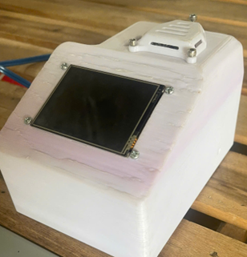
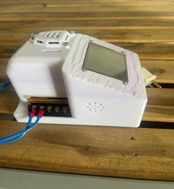
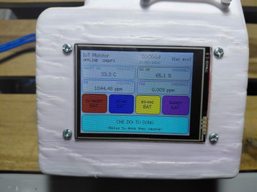
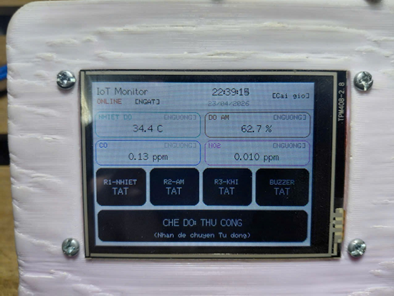

# IoT Environmental Monitoring System

Hệ thống giám sát môi trường thời gian thực sử dụng ESP32, được thiết kế để đo và theo dõi các thông số nhiệt độ, độ ẩm, khí CO và khí NO2. Dự án kết hợp phần cứng nhúng, giao diện hiển thị tại thiết bị, backend lưu trữ dữ liệu và ứng dụng giám sát từ xa, phù hợp cho các mô hình phòng thí nghiệm, lớp học, nhà xưởng nhỏ hoặc khu vực cần cảnh báo chất lượng không khí cục bộ.

Thiết bị có thể hoạt động độc lập với màn hình cảm ứng tại chỗ, đồng thời đồng bộ dữ liệu lên backend khi có WiFi. Người dùng có thể quan sát thông số đo, thay đổi ngưỡng cảnh báo, chuyển chế độ điều khiển tự động/thủ công và theo dõi trạng thái relay, buzzer thông qua giao diện thiết bị hoặc ứng dụng.

## Hình ảnh dự án

| Mặt trước thiết bị | Góc nhìn tổng thể |
| --- | --- |
|  |  |

| Giao diện chế độ tự động | Giao diện chế độ thủ công |
| --- | --- |
|  |  |

## Chức năng chính

- Đo nhiệt độ và độ ẩm bằng cảm biến SHT31.
- Đo nồng độ khí CO và NO2 qua ngõ ADC của ESP32.
- Hiển thị dữ liệu trực tiếp trên màn hình TFT cảm ứng.
- Quản lý thời gian bằng RTC DS3231 và có thể đồng bộ NTP khi kết nối mạng.
- Điều khiển 3 relay và buzzer theo hai chế độ:
  - `Auto`: tự động bật/tắt relay dựa trên ngưỡng nhiệt độ, độ ẩm, CO và NO2.
  - `Manual`: người dùng bật/tắt relay trực tiếp trên màn hình hoặc từ ứng dụng.
- Cho phép chỉnh ngưỡng cảnh báo ngay trên thiết bị.
- Kết nối WiFi, gửi telemetry lên backend và nhận trạng thái điều khiển từ server.
- Backend hỗ trợ REST API, MQTT, Socket.IO realtime, xác thực JWT và lưu dữ liệu bằng SQLite.
- Ứng dụng Flutter dùng để đăng nhập, xem danh sách thiết bị, theo dõi chỉ số và quản lý điều khiển từ xa.
- Có thiết kế PCB bằng KiCad và mô hình cơ khí bằng SolidWorks/STEP.

## Kiến trúc hệ thống

```text
ESP32 + cảm biến + relay + buzzer + TFT
        |
        | HTTP / WiFi
        v
Backend Fastify + SQLite + MQTT + Socket.IO
        |
        | REST API / realtime
        v
Ứng dụng Flutter giám sát và điều khiển
```

Firmware ESP32 được tổ chức theo các module riêng cho cảm biến, WiFi, RTC, relay, giao diện và bộ điều phối chính. `AppController` chạy nhiều task FreeRTOS để tách riêng cập nhật giao diện, đọc cảm biến, điều khiển relay và đồng bộ backend, giúp thiết bị phản hồi ổn định hơn khi vừa hiển thị vừa truyền dữ liệu.

Backend đóng vai trò trung gian lưu dữ liệu thiết bị, quản lý trạng thái điều khiển mong muốn, nhận telemetry từ ESP32 và phát cập nhật realtime cho ứng dụng. Frontend Flutter cung cấp giao diện đăng nhập, danh sách thiết bị, trang chi tiết thiết bị, biểu đồ/chỉ số đo và quản lý người dùng.

## Cấu trúc thư mục

```text
.
├── Code/
│   ├── backend/backend/          # Backend Fastify, SQLite, MQTT, Socket.IO
│   ├── firmware/IoT_ESP32_Local/ # Firmware ESP32 Arduino/C++
│   └── frontend/                 # Ứng dụng Flutter
├── PCB/                          # File thiết kế PCB KiCad, BOM và Gerber
├── Solidwork/                    # Mô hình cơ khí và file STEP
├── images/                       # Hình ảnh thiết bị và giao diện thực tế
├── LICENSE
└── README.md
```

## Công nghệ sử dụng

- Phần cứng: ESP32, SHT31, cảm biến khí CO/NO2, RTC DS3231, TFT cảm ứng, relay, buzzer.
- Firmware: Arduino/C++, FreeRTOS task, HTTPClient, WiFi, giao diện cảm ứng.
- Backend: Node.js, Fastify, SQLite (`better-sqlite3`), JWT, MQTT.js, Socket.IO.
- Frontend: Flutter, Material 3, REST API.
- Thiết kế phần cứng: KiCad, SolidWorks.

## Chạy backend

```bash
cd Code/backend/backend
npm install
npm run seed
npm run dev
```

Backend mặc định chạy tại:

```text
http://localhost:3000
```
Tài khoản mặc định sau khi seed:

```text
Username: admin
Password: Admin@123
```
## Firmware ESP32
Firmware nằm tại:

```text
Code/firmware/IoT_ESP32_Local
```
Mở file `IoT_ESP32_Local.ino` bằng Arduino IDE hoặc môi trường tương thích ESP32, cài các thư viện cần thiết cho màn hình TFT, cảm ứng, WiFi và cảm biến, sau đó nạp chương trình vào ESP32. Khi thiết bị khởi động, hệ thống sẽ đọc cảm biến định kỳ, cập nhật màn hình, xử lý điều khiển relay/buzzer và đồng bộ dữ liệu với backend nếu đã cấu hình WiFi và Backend URL.

## Ứng dụng Flutter
Ứng dụng nằm tại:

```text
Code/frontend
```
Chạy ứng dụng:
```bash
cd Code/frontend
flutter pub get
flutter run
```
Ứng dụng dùng API backend để đăng nhập, lấy danh sách thiết bị, xem dữ liệu realtime và gửi lệnh điều khiển.

## Ghi chú
- Cấu hình backend có thể tham khảo trong `Code/backend/backend/.env.example`.
- File thiết kế PCB, BOM và Gerber nằm trong thư mục `PCB`.
- Mô hình cơ khí của thiết bị nằm trong thư mục `Solidwork`.
- Thiết bị có thể hoạt động cục bộ trên màn hình cảm ứng ngay cả khi chưa kết nối backend, nhưng cần WiFi và Backend URL để đồng bộ dữ liệu từ xa.
